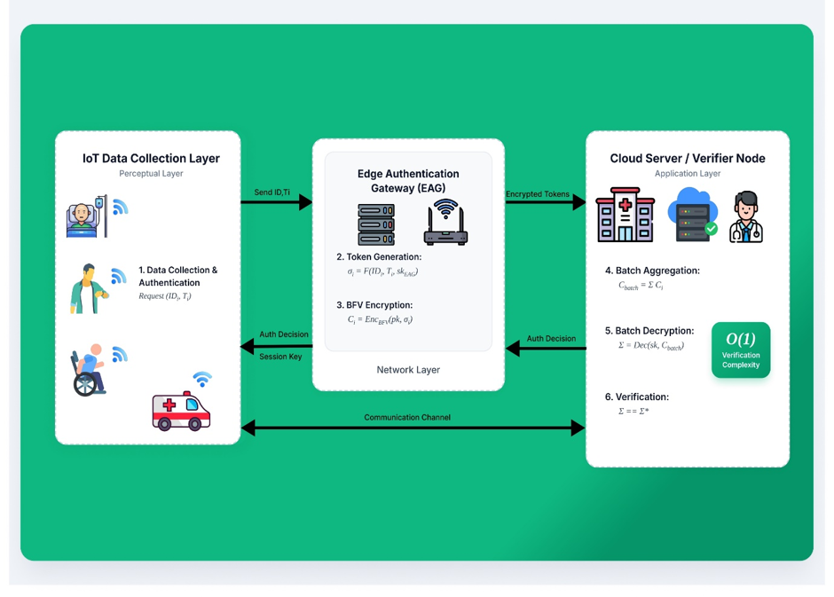
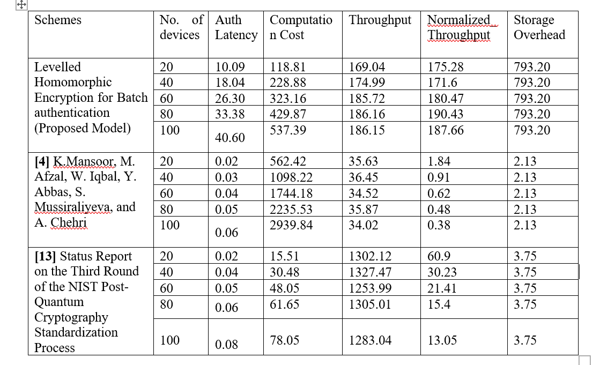

<div align="center">

# PQ-Batch-Auth-BFV

### Levelled Homomorphic Encryption for $O(1)$ Post-Quantum Batch Authentication in IoT Healthcare Networks

[](https://www.python.org/)
[](https://opensource.org/licenses/MIT)
[](https://ubuntu.com/)
[](https://github.com/)

</div>

---

## Table of Contents
* [Core Architectural Constraints](#core-architectural-constraints)
* [Advanced Edge-to-Cloud Architecture](#advanced-edge-to-cloud-architecture)
* [Deep Dive: Homomorphic Token Processing](#deep-dive-homomorphic-token-processing)
* [Performance and Scalability Benchmarks](#performance-and-scalability-benchmarks)
* [Building and Execution](#building-and-execution)
* [License](#license)

---

## Core Architectural Constraints

* **Constant-Time $O(1)$ Verification:** The centralized Cloud Verifier authenticates batches of arbitrary size with a single homomorphic decryption step. Computational overhead on the server scales independently of the active node density ($N$).
* **Zero-Trust Edge Processing:** The Edge Authentication Gateway (EAG) aggregates verification payloads homomorphically. The EAG lacks decryption capabilities (no access to the private key), preventing credential compromise at the network edge.
* **RLC Anti-Cancellation:** Employs Randomized Linear Combinations (RLC) via random scalar coefficients ($\alpha_i$) to defeat cancellation attacks. Malicious nodes cannot forge valid batch outcomes by introducing self-canceling token vectors.

---

## Advanced Edge-to-Cloud Architecture



This framework relies on a decoupled three-tier topology designed to optimize processing efficiency and minimize wide-area network bandwidth consumption:

1. **IoT Perceptual Layer (Sensors):** Edge sensors generate localized authentication tokens ($\sigma_i$), encode them into polynomials, encrypt them using the BFV public key ($pk$), and forward them.
2. **Edge Authentication Gateway (EAG):** An intermediate gateway that intercepts encrypted tokens, applies random linear coefficients ($\alpha_i$), and computes the randomized homomorphic sum $C_{\text{batch}} = \sum (\alpha_i \cdot C_i)$. By grouping $N$ ciphertexts into a single batch ciphertext, edge aggregation reduces the upload bandwidth requirements by a factor of $N$.
3. **Cloud Verifier:** The root authority holding the secret key ($sk$). It performs a single decryption on $C_{\text{batch}}$ and evaluates the integrity of the entire batch in a single pass.

---

## Deep Dive: Homomorphic Token Processing

The cryptographic pipeline enforces strict mathematical progression across the tiers:

### 1. Token Generation
Each device $i$ computes a keyed pseudo-random function (PRF) mapped to a polynomial vector:
$$\sigma_i = \text{PRF}(ID_i \parallel t_i \parallel sk_{\text{EAG}})$$
where $ID_i$ is the unique device identifier, $t_i$ is the synchronized epoch timestamp, and $sk_{\text{EAG}}$ is a symmetric key shared between the devices and the verifier.

```python
# Mapped to a BFV SIMD plaintext vector
data = f"{device_id}|{timestamp}|{sk_eag}".encode()
digest = hashlib.sha256(data).digest()
sigma = np.frombuffer(digest, dtype=np.uint8)[:vector_size]
```

### 2. BFV Plaintext Polynomial Encoding & Encryption
Plaintext vectors are encoded and encrypted under the Brakerski/Fan-Vercauteren scheme:
$$C_i \leftarrow \text{Enc}_{\text{BFV}}(pk, \sigma_i)$$

```python
plaintext = HE.encodeInt(sigma_vector)
ciphertext = HE.encryptPtxt(plaintext)
```

### 3. Homomorphic Batch Aggregation
The EAG applies randomized linear combination (RLC) with coefficients $\alpha_i \in [1, 9]$:
$$C_{\text{batch}} = \sum_{i=1}^{N} \alpha_i \cdot C_i$$

```python
C_batch = ciphertexts[0] * coefficients[0]
for ct, alpha in zip(ciphertexts[1:], coefficients[1:]):
    C_batch += ct * alpha
```

### 4. Decryption & Verification
The Cloud Verifier decrypts the batch and asserts validity modulo the plaintext modulus $t$:
$$D_{\text{batch}} = \text{Dec}_{\text{BFV}}(sk, C_{\text{batch}}) \equiv \sum_{i=1}^{N} \alpha_i \cdot \sigma_i \pmod t$$

```python
decrypted = HE.decryptInt(C_batch)
assert np.allclose(decrypted % t, expected_mod % t)
```

---

## Performance and Scalability Benchmarks



Evaluation metrics demonstrate high operational efficiency compared to linear signature verification schemes under identical scaling tests.

### Metric Comparison ($N = 100$ Devices)

| Scheme | Verifier Latency (ms) | E2E Throughput (Dev/s) | Storage Overhead (KB) | Verification Complexity |
| :--- | :---: | :---: | :---: | :---: |
| **PQ-Batch-Auth-BFV (Ours)** | **40.60** | **186.00** | **~245.00 (Keys/Ctx)** | **$O(1)$** |
| **Falcon-512 (PQ-IBS)** | ~20.00 | ~147.00 | ~2.12 | $O(N)$ |
| **PQCAIE (Dilithium-2)** | ~43.00 | ~120.00 | ~3.75 | $O(N)$ |

* **Constant Decryption Overhead:** Decryption scaling is completely flat at **~1.9 ms** regardless of batch sizes (up to 100 devices).
* **Throughput Stability:** The proposed scheme maintains stable operational throughput of **~186 operations/sec**, outperforming multi-step verification models.

---

## Building and Execution

Follow these steps to run the simulation natively under WSL/Ubuntu.

### 1. Configure System Environment
Ensure your local compiler toolchain and CMake are updated:
```bash
sudo apt update && sudo apt upgrade -y
sudo apt install -y python3 python3-pip python3-venv build-essential cmake
```

### 2. Set Up Virtual Environment & Dependencies
Create a isolated Python workspace and install the required numerical and cryptographic libraries:
```bash
python3 -m venv venv
source venv/bin/activate
pip install numpy pyfhel
```

### 3. Run Benchmark Simulation
Execute the main evaluation script to verify mathematical correctness and output scalability metrics:
```bash
python3 Bfv_final2.py
```

---

## License

This project is licensed under the MIT License - see the [LICENSE](LICENSE) file for details.
